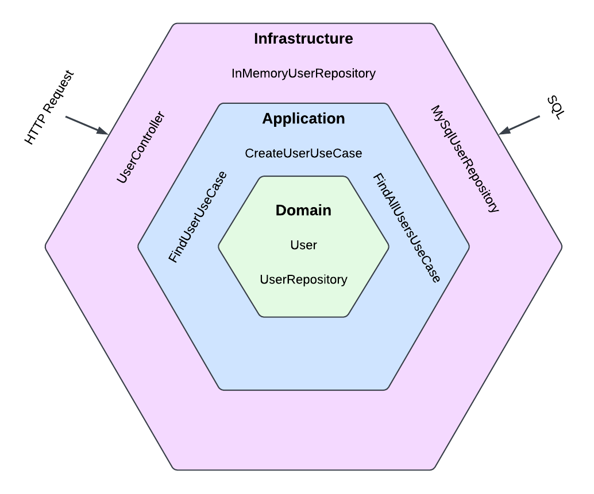

# Hexagonal Express API

## Descripción

Hexagonal Express API es un proyecto scaffolding que implementa una arquitectura hexagonal utilizando Node.js, Express Y Typescript. Este enfoque permite una separación clara de las preocupaciones, facilitando la prueba y el mantenimiento del código. El proyecto incluye un caso de uso para la creación de usuarios y un repositorio simulado para pruebas, lo que ayuda a los desarrolladores a comenzar rápidamente sin tener que construir la estructura desde cero.



## Ventajas

- **Arquitectura Hexagonal**: Promueve una separación clara entre la lógica de negocio y las dependencias externas, lo que facilita la prueba y el mantenimiento.
- **Pruebas Unitarias**: Incluye pruebas unitarias para asegurar que la lógica de negocio funcione correctamente.
- **Flexibilidad**: Permite cambiar fácilmente las implementaciones de las dependencias (como bases de datos) sin afectar la lógica de negocio.
- **Escalabilidad**: La estructura modular permite agregar nuevas características y casos de uso sin complicar el código existente.

## Requisitos

- Node.js (v14 o superior)
- npm (v6 o superior)
- MySQL (opcional, si se utiliza la base de datos)

## Instalación

1. Clona el repositorio:

   ```bash
   git clone https://github.com/pau7rr/hexagonal-express-api.git
   cd hexagonal-express-api
   ```

2. Instala las dependencias:

   ```bash
   npm install
   ```

3. (Opcional) Configura la base de datos MySQL si planeas usarla. Asegúrate de tener una base de datos creada y actualiza la configuración en el archivo correspondiente.

## Uso

### Ejecutar el Servidor

Para iniciar el servidor en local, ejecuta:

```bash
npm run dev
```

El servidor se ejecutará en `http://localhost:3000` (o el puerto que hayas configurado).

### Ejecutar Pruebas

Para ejecutar las pruebas, utiliza:

```bash
npm run test
```

Esto ejecutará todas las pruebas unitarias y mostrará los resultados en la consola.

### Crear un Usuario

Puedes crear un usuario enviando una solicitud POST a la siguiente ruta:

```
POST /api/users
```

**Cuerpo de la solicitud**:

```json
{
  "id": "1",
  "name": "Test User",
  "email": "test@example.com"  
}
```

## Estructura del Proyecto

```
hexagonal-express-api/
├── src/
│   ├── application/
│   │   ├── create-user.use-case.ts
│   │   ├── find-user.use-case.ts
│   │   └── find-all-users.use-case.ts
│   ├── domain/
│   │   ├── user.entity.ts
│   │   └── user.repository.ts
│   ├── infrastructure/
│   │   ├── http/
│   │   │   └── user.controller.ts
│   │   └── persistence/
│   │       ├
│   │       └── in-memory-user.repository.ts
├── tests/
│   └── create-user.use-case.test.ts
├── package.json
└── README.md
```

## Contribuciones

Las contribuciones son bienvenidas. Si deseas contribuir, por favor sigue estos pasos:

1. Haz un fork del repositorio.
2. Crea una nueva rama (`git checkout -b feature/nueva-caracteristica`).
3. Realiza tus cambios y haz commit (`git commit -m 'Agrega nueva característica'`).
4. Envía un pull request.

## Licencia

Este proyecto está bajo la Licencia MIT. Consulta el archivo [LICENSE](LICENSE) para más detalles.

## Contacto

Si tienes preguntas o comentarios, no dudes en contactarme en [pau.rosquellas@gmail.com](mailto:pau.rosquellas@gmail.com).
